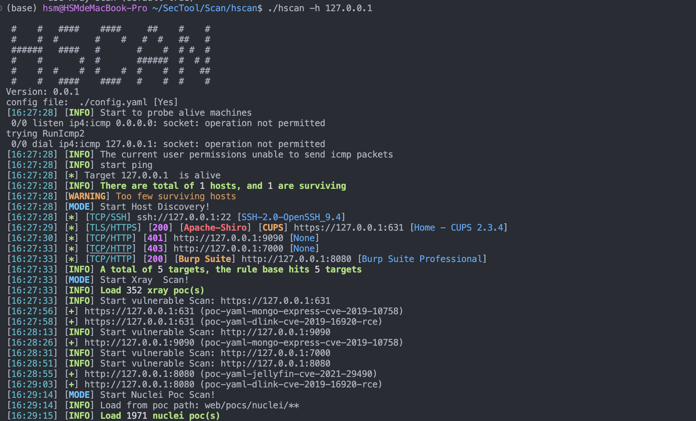

# hscan 网络资产收集与漏洞扫描


## ✨ 功能
- 探活
- 服务扫描(常规 & 非常规端口)
- poc探测( xray v2 & nuclei 格式)
- 数据库等弱口令爆破
- 内网常见漏洞利用

### 快速使用

```
sudo ./hscan -h IP或IP段 
sudo ./hscan -hf IP或IP段的文件 
sudo ./hscan -u url(支持http、ssh、ftp、smb等) 
sudo ./hscan -uf url文件 
```

### 示例


- (1) 资产扫描
  ```
  sudo ./hscan -h 127.0.0.1
  ```


- (2) poc探测 (默认使用 xray poc 和 neclei poc 扫描),如需反联验证，请配置好 ceyeKey 和 ceyedomain 参数（命令行 | config.yaml）。
  ```
  sudo ./hscan -u http://127.0.0.1
  ```
  
- (3) poc探测 (使用xray)
  ```
  sudo ./hscan -u http://127.0.0.1 --xray
  ```
  
- (4) poc探测 (使用neclei)
  ```
  sudo ./hscan -u http://127.0.0.1 --neclei
  ```
  
> poc路径分别在/web/pocs/xray2和/web/pocs/nuclei/目录下，其中xray poc随编译嵌入到程序中，nuclei poc需要根据路径动态加载。

> 如不想使用很多参数，可以更改默认参数，在hascn相同目录下创建config.yaml文件并进行配置即可。

## 借鉴
借鉴参考了下列优秀作品
- [x] nacs https://github.com/u21h2/nacs 事件驱动的渗透测试扫描器
- [x] kscan https://github.com/lcvvvv/kscan 专注于信息收集 能探测到非常规端口开的服务 比如2222的ssh
- [x] dismap https://github.com/zhzyker/dismap 资产收集
- [x] pocV https://github.com/WAY29/pocV 能扫描xray和nuclei的poc


# 免责声明
本工具仅面向合法授权的企业安全建设行为，如您需要测试本工具的可用性，请自行搭建靶机环境。
为避免被恶意使用，本项目所有收录的poc均为漏洞的理论判断，不存在漏洞利用过程，不会对目标发起真实攻击和漏洞利用。
在使用本工具进行检测时，您应确保该行为符合当地的法律法规，并且已经取得了足够的授权。请勿对非授权目标进行扫描。
如您在使用本工具的过程中存在任何非法行为，您需自行承担相应后果，我们将不承担任何法律及连带责任。

